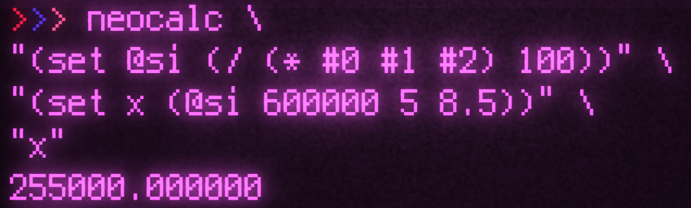

<div align="center">
  
  <h1>neocalc</h1>

  A small lisp-like calculator with variables.
</div>

## Highlights

- Calculator
- Lisp-like evaluation
- Uses Stack System; no linked list
- Easy to implement your own operators (see `list_op` function in main.c)

> neocalc is an evolution of the [calc](https://github.com/zakarouf/simple_calc) my first ever program.

---

## Building

### Requied Libraries

- [Readline](https://tiswww.case.edu/php/chet/readline/rltop.html): For REPL
- [z_](https://github.com/zakarouf/z_): For all the boilerplate stuff

After fetching all the libraries run
```
sh build.sh
```

This will create a binary `nc`.

## Using NeoCalc

```sh
./nc
```
> Will Initiate the REPL

```racket
$ ./nc
Welcome to neocalc (https://github.com/zakarouf/neocalc)
neocalc 0.2.1 by zakarouf 2022-2023 (/q to exit)
> 13
_ is 13.000000
```
Type any number to push to the default variable `_`.

### Evaluation

Expression are written in S-Expression like syntax.
```racket
> (+ 1 2 3)
_ is 6.000000
```

They can be nested too!
```racket
> (- 40 (* 12 4))
_ is -8.000000
> (- 40 (* 12 4) (/ 22 7) (+ 24 (- 20 77)))
stdout:21.857143
```

### Defining Variables

You can store a result of an expression inside a variable using `set` command
```racket
> (set x (+ 1 2 3))
> /v x
x is 6.000000
```
> NOTE: `/v` is a repl command that sets a result variable

You can call that variable again inside an expression to use its value again.
```racket
> (* 2 x)
x is 12.000000
```

### Defining Expression

One can define a expression like so
```racket
> (set @sqr (* #0 #0))
> (@sqr 3)
_ is 9.000000
```
> `#[0-9]+` is used to define a passed argument

### Loading a file

It is a hassle to set the same boilerplate symbols and values over and over
again. Instead we can write all our definations and load it in when we need.
```racket
# util.txt
(set @snd (+ (* 2 #0) 1))
(set @sqr (* #0 #0))
(set @sa (@sqr (@snd #0)))
```
> NOTE: Repl specific commands, i.e. `/v`, '/q' etc. are not valid here

We load it up in our relp, like so
```racket
> (load util.txt)
> (@sa 0)
_ is 1.000000
> (@sa 1)
_ is 9.000000
```

### Built-in Functions

There are various *'Built-in Functions'* avaliable from the get go.<br />
They can be called, like so
```c
($sin _PI)
```
> Built-in functions are called using the dollarsign prefix `$`

We can also create a our own functions, compile and bundle them with the program or load them as a on runtime as dynamic libraries.
```c
#define NC_DEVELOPMENT
#include "nc.h"

#define fn(name) _built_in__##name
#define defn(name)\
  static nc_float fn(name) (nc_State *s, char *rest_expr)

defn(max) {
  nc_float *x = &z__Arr_getVal(s->stacks.v, z__Arr_getTop(s->stacks.retpoints).ret),
           *x_end = &z__Arr_getTopEmpty(s->stacks.v);
  nc_float res = *x;
  x++;
  while(x < x_end) {
    res = *x > res? *x: res;
    x++;
  }
  return res;
}

void load_built_in(nc_State *s)
{
  nc_State_setfn(s, "max", fn(max));
}
```
```c
extern load_built_in(nc_State *s);
int main (int argc, char const *argv[])
{
  nc_State *s = nc_State_new();
  load_built_in(s);
  
  /**
      Do Some Evaluation ...
  */

  nc_State_delete(s); 
}
```
After Compiling we can use it as such,
```c
>>> neocalc
Welcome to neocalc (https://github.com/zakarouf/neocalc)
neocalc 0.2.1 by zakarouf, (`/q` to exit or `/h` for help)
> ($max 2 5 21 1)
_ is 21.000000
```

## Speed

Its 36 to 40 times slower than a `c` compiled code. According to my findings it is due to `atof` function that is converting ascii numerials to float. Therefore I'll recommend using variables instead  of literals, variables are way faster, infact it can increase evaluation speed by 40%.
<br />

---
Now that doesn't mean its not usable either, I mean *its still faster than any major interpretor language so*.
Also I dont think `neocalc` calc is going to get any slower though, as a matter of fact just by doing several code changes for optimization, `neocalc` got 125% (god bless callgrind). So while adding new features its only gonna get faster :>
